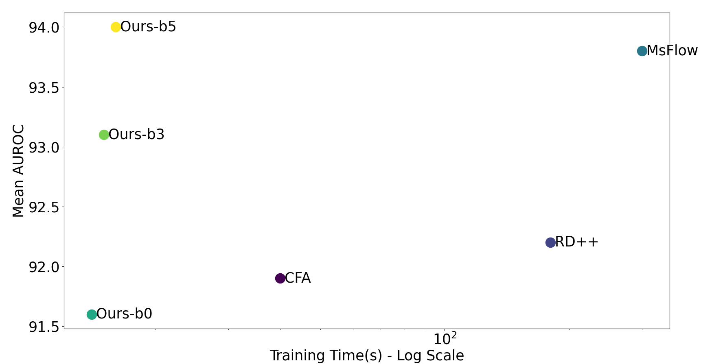
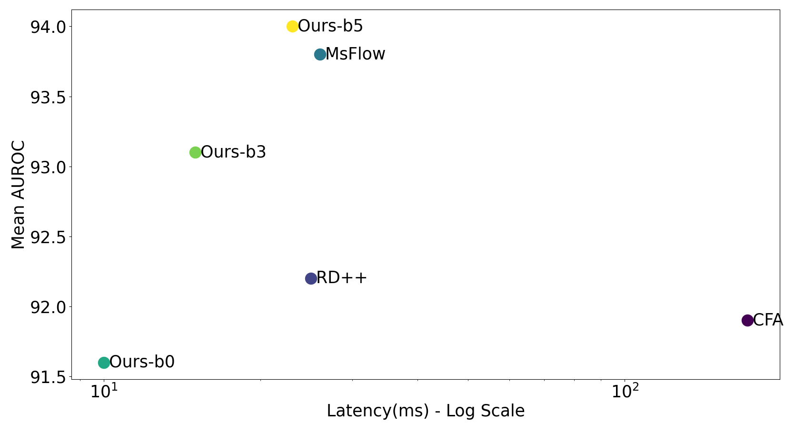
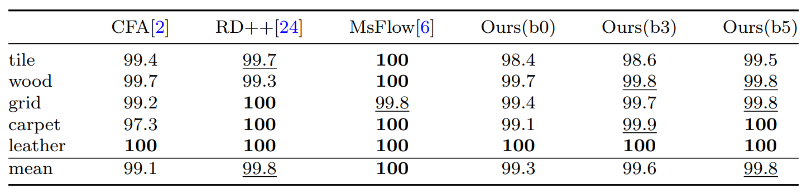

<p align="center">
  <h1><center> Multi-Layer Transfer Learning </center></h1>
</p>

## Official implementation of the paper : "Efficient Fabric Anomaly Detection: A Transfer Learning Framework with Expedited Training Times"
Article : Not published yet (accepted Textile Research Journal)


<p align="center">
  
</p>


## Getting Started

You will need [Python 3.10+](https://www.python.org/downloads) and the packages specified in _requirements.txt_.

Install packages with:

```
$ pip install -r requirements.txt
```

## Configure and Run
To run the code, please download the MVTEC AD dataset and place it in dataset/MVTEC  
Link to download the dataset : https://www.mvtec.com/company/research/datasets/mvtec-ad 

To run train and test the model : 
```
python train.py 
```
To modify the object categories, hyperparameters or dataset path, you can modify the config.yaml file.

## When to use this approach ? 
In the texture defect detection process, particularly within the textile industry, fast training and inference are crucial for productivity. This model offers near state-of-the-art performance with significantly faster training and inference times.
<p align="center">
    
</p>
<p align="center">
  
</p>

## Citation
Please cite our paper in your publications if it helps your research. Even if it does not, you are welcome to cite us.
```
Thomine S, Snoussi H. Efficient Fabric Anomaly Detection: A Transfer Learning Framework with Expedited Training Times. Textile Research Journal.
```
## License

This project is licensed under the MIT License.